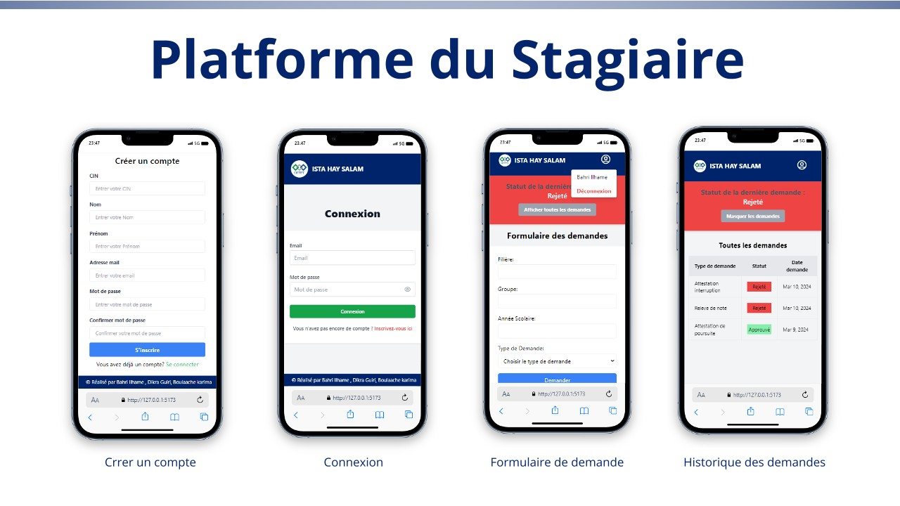
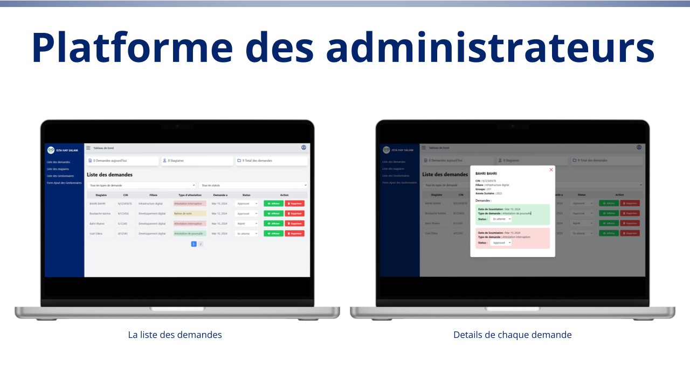
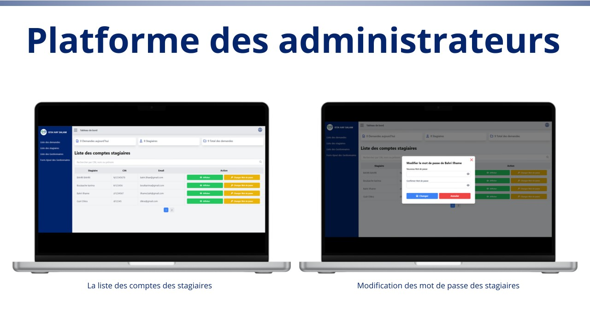
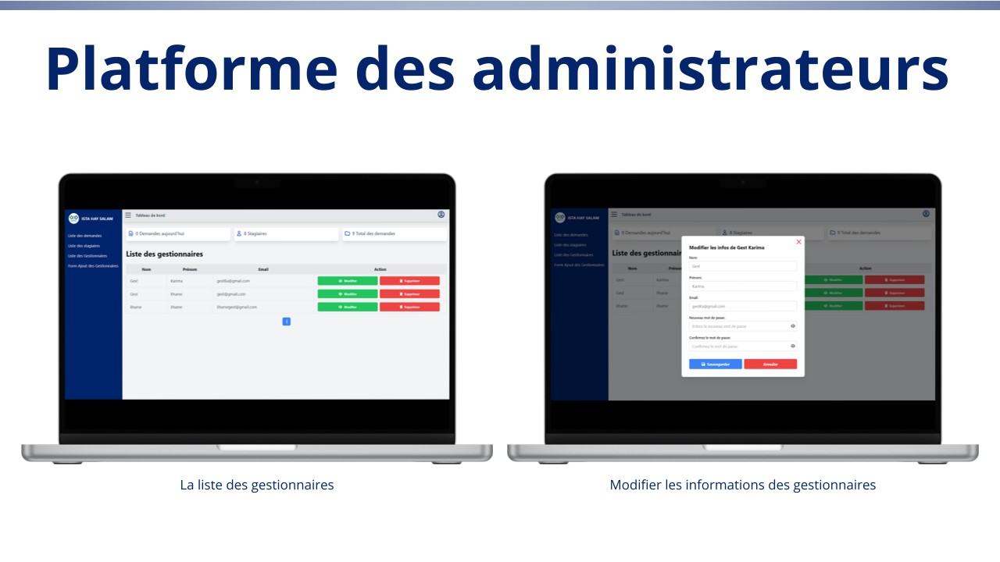
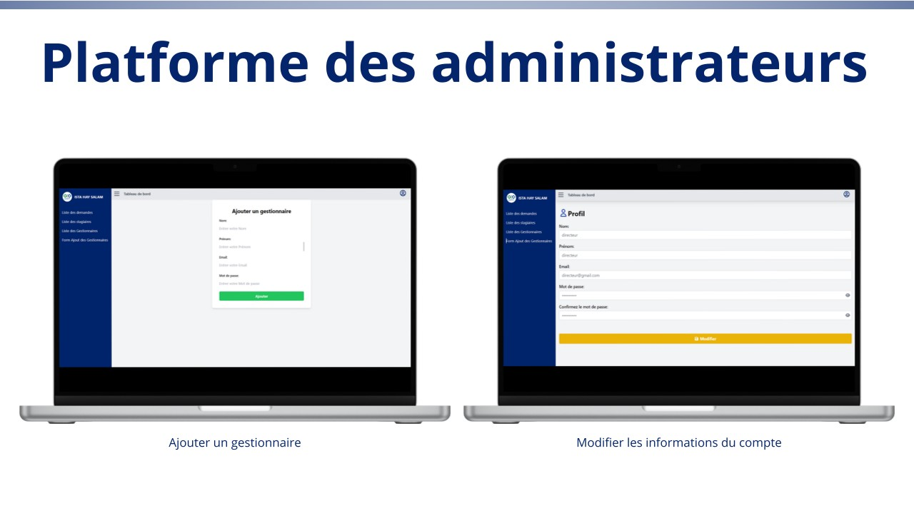
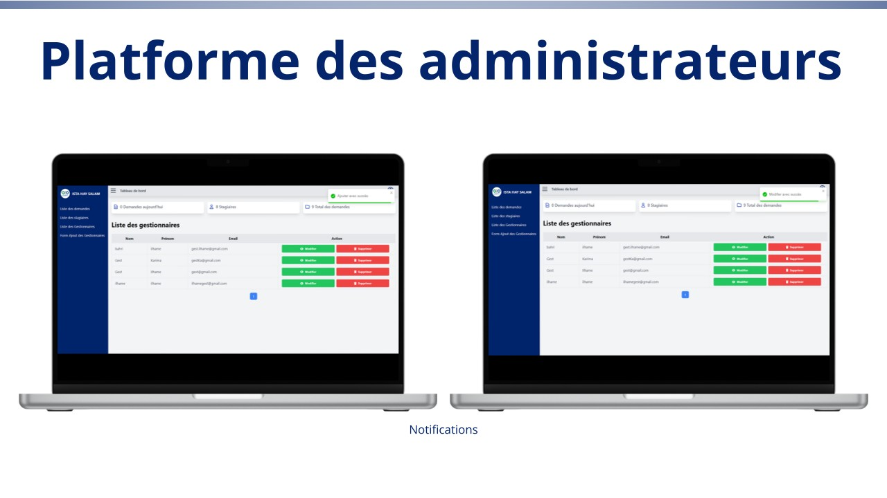

# 🎓 Gestion des demandes — ISTA Hay Salam
Application web Full Stack permettant de **digitaliser et gérer les demandes administratives** des étudiants de l'ISTA Hay Salam.









---

## 📌 Présentation

Cette application permet aux étudiants de :

* créer une demande en ligne ;
* consulter leurs demandes ;
* suivre leur statut ;
* consulter les détails d'une demande.

L'administration dispose d'un espace permettant de **consulter et traiter les demandes**.

L'objectif est de remplacer la gestion manuelle par une solution numérique simple et centralisée.

---

## ✨ Fonctionnalités

### 👤 Étudiant

* Inscription / Connexion
* Création d'une demande
* Consultation des demandes
* Suivi du statut
* Consultation des détails

### 👨‍💼 Administration

* Tableau de bord
* Consultation des demandes
* Gestion des demandes
* Mise à jour des statuts
* Gestion des utilisateurs

---

## 🛠️ Technologies

| Partie          | Technologies                 |
| --------------- | ---------------------------- |
| Frontend        | React.js, Vite, Tailwind CSS |
| Backend         | Laravel, PHP                 |
| Base de données | MySQL                        |
| Gestion du code | Git & GitHub                 |

---

## 🏗️ Architecture

```text
React + Vite
     │
     │ API
     ▼
Laravel
     │
     ▼
MySQL
```

Le projet est organisé en deux parties principales :

```text
Gestion-demandes-ISTA/
│
├── frontend/
├── backend/
├── gestion_demandes_ista.sql
└── README.md
```

---

## 📸 Captures d'écran


---

## 👩‍💻 Auteur
**Bahri Ilhame**

---

⭐ Si ce projet vous intéresse, n'hésitez pas à lui donner une étoile !
